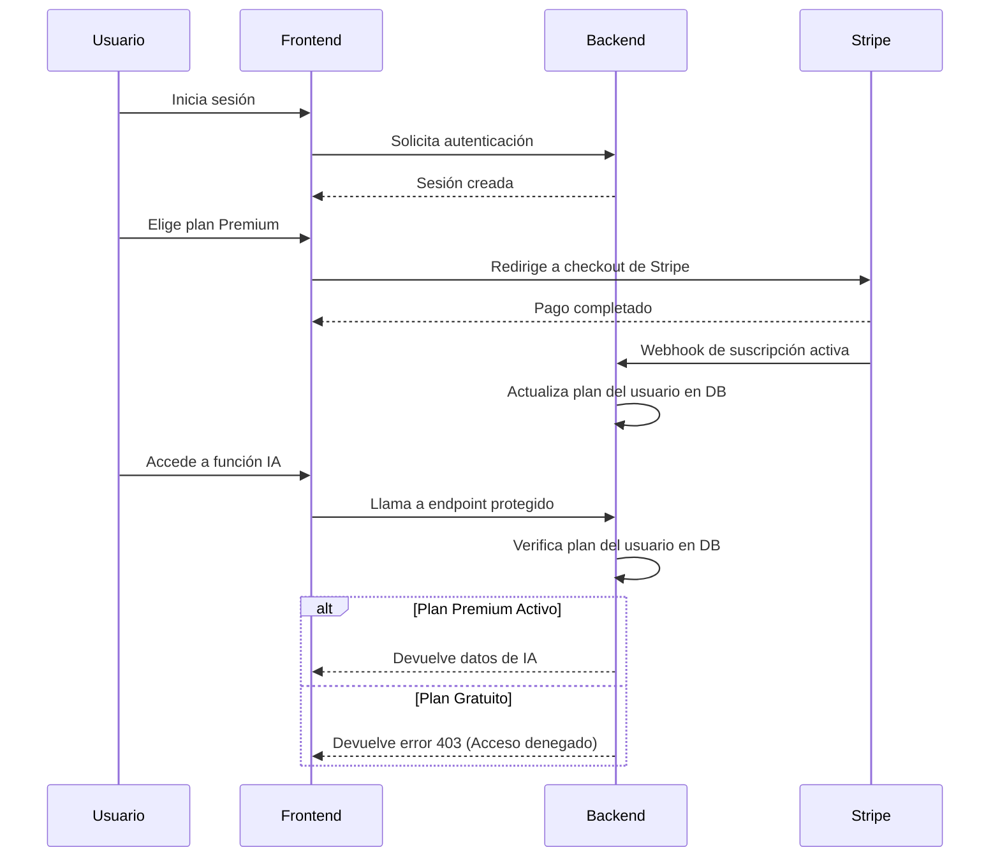

# Licenciamiento y Monetización de Piano Emotion Manager

## Resumen Ejecutivo

Para licenciar y monetizar Piano Emotion Manager, la mejor estrategia es un **modelo SaaS (Software as a Service) con suscripciones por niveles**, gestionado a través de una plataforma de pagos como **Stripe**. Esto permite controlar el acceso a funcionalidades premium y generar ingresos recurrentes.

---

## 1. Modelo de Licenciamiento: SaaS con Suscripciones

El modelo SaaS es el estándar de la industria y el más adecuado para Piano Emotion Manager. En lugar de vender una licencia de por vida, los usuarios pagan una cuota recurrente (mensual o anual) por el acceso.

### Ventajas del Modelo SaaS

| Ventaja | Descripción |
|---------|-------------|
| **Ingresos recurrentes** | Flujo de caja predecible y estable |
| **Control de acceso** | Fácil de restringir funcionalidades según el plan |
| **Actualizaciones sencillas** | Todos los usuarios tienen siempre la última versión |
| **Escalabilidad** | Fácil de añadir nuevos usuarios y planes |
| **Menor piratería** | El acceso se valida en el servidor, no en el cliente |

### Estructura de Planes (ya implementada)

La app ya tiene una estructura de planes por niveles que podemos aprovechar:

| Plan | Dirigido a | Funcionalidades Clave |
|------|-------------|-----------------------|
| **Gratuito** | Todos los técnicos | Gestión básica de clientes, pianos y servicios |
| **Profesional** | Técnicos independientes | Comunicaciones (WhatsApp, Email), marketing |
| **Empresa** | Equipos de técnicos | Multi-técnico, reportes de equipo |

**Propuesta:** Añadir un plan **Premium con IA** que incluya las funcionalidades avanzadas que hemos desarrollado.

---

## 2. Empaquetado y Control de Acceso

Para controlar el acceso, combinaremos la autenticación de usuarios con la verificación del estado de su suscripción.

### Arquitectura de Control de Acceso

1. **Autenticación de Usuario (ya implementada)**:
   - El usuario inicia sesión a través de un proveedor de OAuth (compatible con Manus).
   - El backend verifica la identidad y crea una sesión.

2. **Gestión de Suscripciones (a implementar)**:
   - Se integra una plataforma de pagos como **Stripe**.
   - Cuando un usuario paga, Stripe notifica al backend (vía webhook).
   - El backend actualiza el estado de la suscripción del usuario en la base de datos.

3. **Verificación de Acceso (a implementar)**:
   - Para acceder a una funcionalidad premium, el frontend hace una llamada a un endpoint protegido (`protectedProcedure`).
   - El backend verifica el estado de la suscripción del usuario antes de permitir el acceso.

### Diagrama de Flujo

---

## 3. Plataforma de Pagos: Stripe

**Stripe** es la plataforma líder para SaaS por su facilidad de integración, documentación y herramientas para desarrolladores.

### ¿Por Qué Stripe?

| Característica | Beneficio |
|-----------------|-----------|
| **Stripe Checkout** | Página de pago pre-construida y optimizada |
| **Stripe Billing** | Gestión completa de suscripciones, facturación y recordatorios |
| **Stripe Customer Portal** | Portal de autoservicio para que los clientes gestionen su suscripción |
| **Webhooks** | Notificaciones en tiempo real para sincronizar con tu backend |
| **Documentación y SDKs** | Fácil de integrar en cualquier lenguaje |

### Alternativas a Stripe

- **Lemon Squeezy**: Más enfocado a software y productos digitales, con gestión de licencias integrada.
- **Paddle**: Plataforma todo en uno que actúa como "Merchant of Record" (se encargan de impuestos y facturación global).
- **Recurly**: Especializado en gestión de suscripciones complejas.

**Recomendación:** Empezar con **Stripe** por su flexibilidad y escalabilidad.

---

## 4. Plan de Implementación

### Paso 1: Configurar Stripe
1. Crear una cuenta en Stripe.
2. Crear los productos y precios correspondientes a los planes (Profesional, Empresa, IA Premium).
3. Obtener las claves de API (pública y secreta).

### Paso 2: Integración en el Backend
1. Añadir las claves de Stripe a las variables de entorno (`STRIPE_API_KEY`, `STRIPE_WEBHOOK_SECRET`).
2. Crear un nuevo servicio `subscription.service.ts` para gestionar la lógica de Stripe.
3. Crear endpoints tRPC para:
   - `createCheckoutSession`: Crear una sesión de pago en Stripe.
   - `handleWebhook`: Recibir notificaciones de Stripe (suscripción creada, actualizada, cancelada).
   - `getCustomerPortal`: Redirigir al portal de cliente de Stripe.
4. Modificar el esquema de la base de datos para añadir campos de suscripción al usuario (`stripeCustomerId`, `plan`, `planStatus`, `planExpiresAt`).

### Paso 3: Integración en el Frontend
1. Instalar el SDK de Stripe.js (`@stripe/stripe-js`).
2. En la pantalla de suscripción (`app/settings/subscription.tsx`), al seleccionar un plan, llamar al endpoint `createCheckoutSession`.
3. Redirigir al usuario a la página de checkout de Stripe.
4. Crear una página de `pago-exitoso` y `pago-cancelado`.

### Paso 4: Proteger Funcionalidades Premium
1. En los endpoints tRPC de funcionalidades premium (ej: `advanced.chat.sendMessage`), añadir una verificación del estado de la suscripción del usuario.
2. Si el usuario no tiene el plan adecuado, devolver un error.
3. En el frontend, mostrar un mensaje para que el usuario actualice su plan.

---

## Conclusión

Para licenciar y monetizar Piano Emotion Manager, la estrategia recomendada es:

1. **Modelo:** SaaS con suscripciones por niveles.
2. **Tecnología:** Stripe para la gestión de pagos y suscripciones.
3. **Control de Acceso:** Verificación en el backend del estado de la suscripción antes de dar acceso a funcionalidades premium.

Este enfoque es robusto, escalable y sigue las mejores prácticas de la industria para aplicaciones SaaS.
