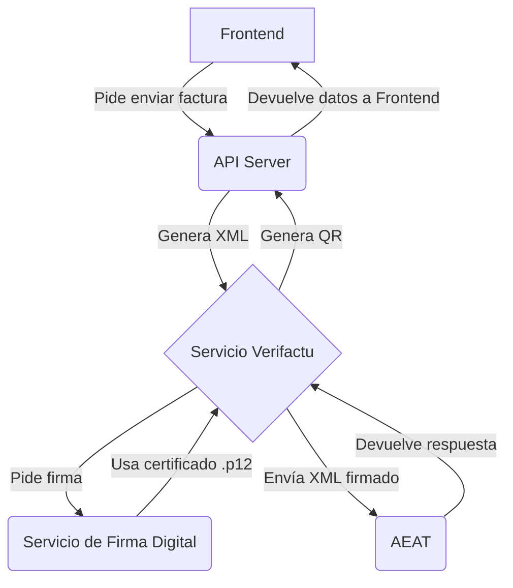

'''
# Guía de Implementación: Verifactu

**Para:** El equipo de desarrollo de Piano Emotion Manager
**De:** Manus AI
**Fecha:** 24 de diciembre de 2025
**Asunto:** Pasos para la puesta en marcha del sistema de facturación electrónica Verifactu

---

## 1. Introducción

Este documento detalla los pasos técnicos necesarios para desplegar y configurar el sistema de facturación electrónica Verifactu, que ha sido implementado en el proyecto `piano-emotion-manager`.

El objetivo es pasar del entorno de pruebas a un sistema de producción completamente funcional y en cumplimiento con la normativa de la Agencia Tributaria (AEAT).

**Arquitectura general:**



---

## 2. Prerrequisitos

Antes de empezar, asegúrate de tener:

1.  **Acceso al repositorio de GitHub** y permisos para hacer push.
2.  **Acceso a la cuenta de Vercel** donde está desplegado el proyecto.
3.  El **certificado digital** en formato `.p12` (`46564879E_JORDI_MIQUEL_NAVARRETE__R__B66351685_1234.p12`).
4.  La **contraseña** del certificado.

---

## 3. Paso 1: Configuración Segura del Certificado

El certificado digital es un archivo sensible y **no debe estar en el repositorio de Git**. Lo configuraremos de forma segura usando los secretos de Vercel.

### 3.1. Convertir el certificado a Base64

Para guardar el archivo `.p12` en una variable de entorno, primero debemos codificarlo en Base64. Abre una terminal en tu máquina local y ejecuta:

```bash
base64 -i /ruta/a/tu/46564879E_JORDI_MIQUEL_NAVARRETE__R__B66351685_1234.p12
```

Copia la cadena de texto resultante. Es un bloque largo de caracteres.

### 3.2. Guardar el certificado en Vercel

1.  Ve a tu proyecto en Vercel.
2.  Ve a **Settings > Environment Variables**.
3.  Crea una nueva variable de entorno:
    *   **Name:** `VERIFACTU_CERT_BASE64`
    *   **Value:** Pega la cadena Base64 que copiaste.
    *   **Type:** `Secret`

El código está preparado para leer esta variable, decodificarla y usarla como si fuera el archivo físico.

---

## 4. Paso 2: Configuración de Variables de Entorno

Ahora, configura el resto de variables en Vercel. **Empieza con el entorno de pruebas.**

| Variable | Valor para Pruebas | Descripción |
|---|---|---|
| `VERIFACTU_CERT_PASSWORD` | `1234` | Contraseña del certificado. **¡Cámbiala por seguridad!** |
| `VERIFACTU_ENVIRONMENT` | `test` | Entorno de la AEAT (test o production) |
| `VERIFACTU_NIF_TITULAR` | `B66351685` | NIF de Inbound Emotion S.L. |
| `VERIFACTU_NOMBRE_TITULAR` | `Inbound Emotion S.L.` | Razón social |
| `VERIFACTU_SERIE_FACTURA` | `PE` | Prefijo para las facturas (Piano Emotion) |
| `VERIFACTU_SOFTWARE_ID` | `PIANO_EMOTION_001` | Identificador único del software |
| `VERIFACTU_SOFTWARE_NOMBRE`| `Piano Emotion Manager` | Nombre del software |
| `VERIFACTU_SOFTWARE_VERSION`| `1.0.0` | Versión actual del software |
| `VERIFACTU_SOFTWARE_NIF` | `B66351685` | NIF del desarrollador del software |

**Importante:** Asegúrate de que todas estas variables estén disponibles en los entornos de **Production, Preview y Development** en Vercel.

---

## 5. Paso 3: Despliegue y Pruebas

1.  **Despliegue:** Haz un push a la rama `main` en GitHub. Vercel desplegará automáticamente los cambios.

2.  **Verificación:**
    *   Ve a la página `/verifactu-settings` en tu aplicación desplegada.
    *   Comprueba que el estado de la conexión y el certificado sean correctos.

3.  **Prueba de Conexión:**
    *   En la página de estado, haz clic en el botón **"Probar conexión con AEAT"**.
    *   Esto enviará una factura de prueba al entorno de pruebas de la AEAT.

**Resultado esperado (éxito):**

```json
{
  "success": true,
  "message": "Conexión con AEAT exitosa",
  "details": {
    "success": true,
    "codigoRegistro": "...",
    "csvFactura": "...",
    "huella": "..."
  }
}
```

**Resultado posible (error):**

```json
{
  "success": false,
  "message": "Error en la conexión",
  "details": {
    "success": false,
    "error": "El certificado no es válido para el NIF indicado",
    "errorCode": "1107"
  }
}
```

Si la prueba es exitosa, el sistema está listo para producción.

---

## 6. Paso 4: Transición a Producción

**¡Atención!** A partir de este punto, las facturas enviadas tienen **validez legal**.

1.  **Cambiar el entorno:**
    *   Ve a las variables de entorno en Vercel.
    *   Edita la variable `VERIFACTU_ENVIRONMENT`.
    *   Cambia su valor de `test` a `production`.

2.  **Redesplegar:**
    *   Ve a la pestaña **Deployments** en Vercel.
    *   Busca el último despliegue y haz clic en **"Redeploy"** para que tome las nuevas variables.

3.  **Prueba final en producción:**
    *   Crea una factura real en la aplicación.
    *   Envíala a Verifactu.
    *   Verifica en la página de estado de Verifactu que se ha enviado correctamente.
    *   Comprueba que el PDF de la factura incluye el código QR.

---

## 7. Paso 5: Monitorización

- **Página de estado (`/verifactu-settings`):** Úsala para monitorizar la conexión y el estado del certificado.
- **Expiración del certificado:** El sistema avisa cuando quedan menos de 30 días para que el certificado expire. Es crucial renovarlo antes de esa fecha para no interrumpir el servicio.
- **Logs de Vercel:** Revisa los logs de las funciones del servidor si encuentras algún error inesperado.

---

Si sigues estos pasos, la implementación será un éxito. Contacta con Manus AI si tienes cualquier duda.
'''
