# Arquitectura del Sistema - Piano Emotion Manager

## Visión General

Piano Emotion Manager sigue una arquitectura moderna de aplicación web full-stack con separación clara entre frontend, backend y servicios externos.

## Diagrama de Arquitectura General

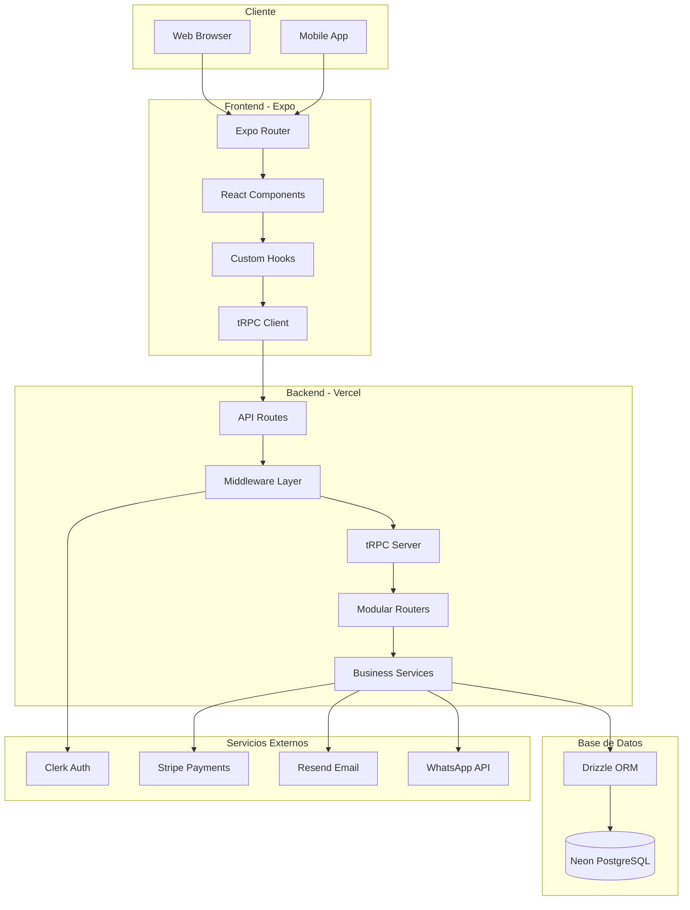

## Arquitectura de Capas

### 1. Capa de Presentación (Frontend)

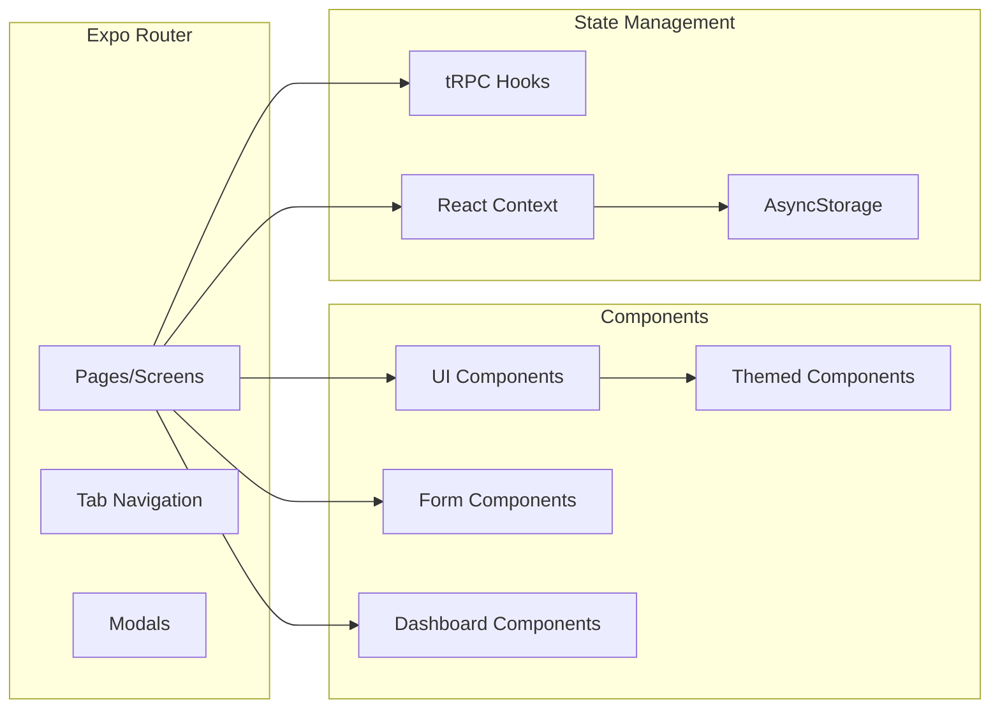

### 2. Capa de API (tRPC)

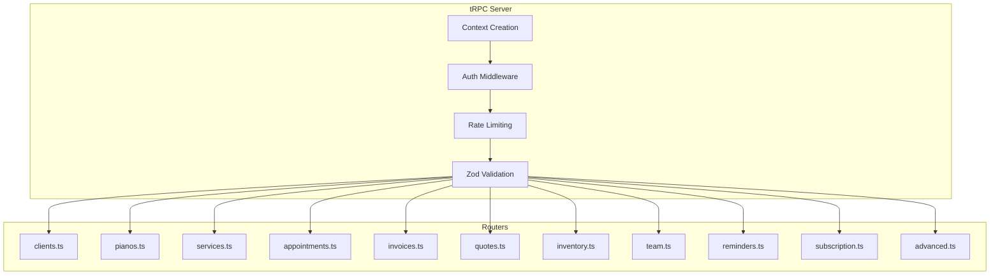

### 3. Capa de Servicios (Business Logic)

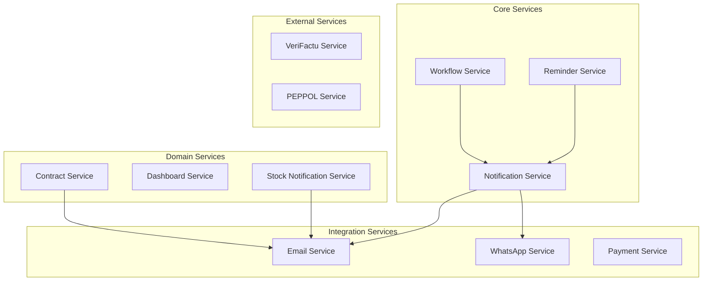

### 4. Capa de Datos (Drizzle ORM)

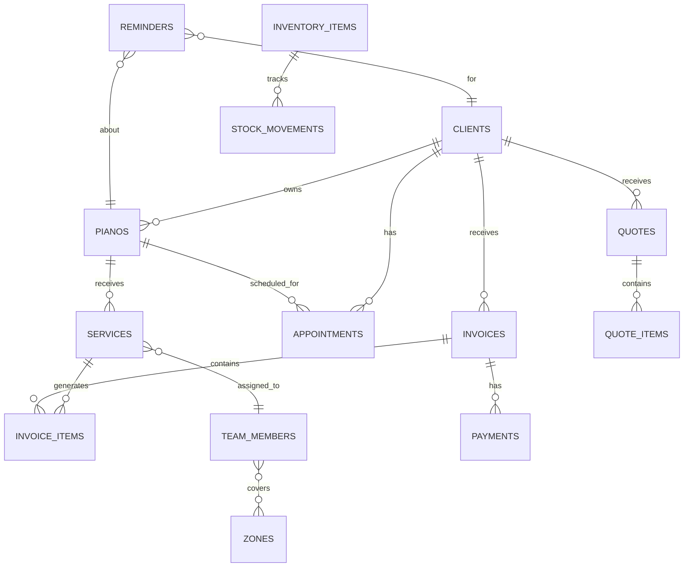

## Flujo de Autenticación

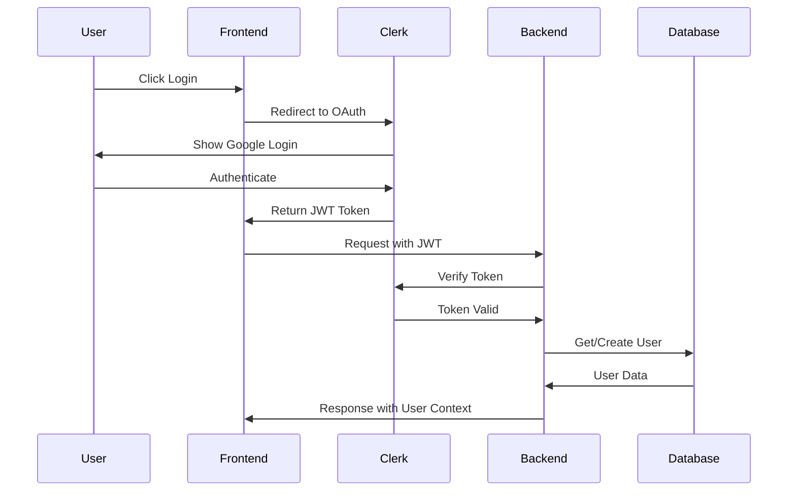

## Flujo de Pago con Stripe

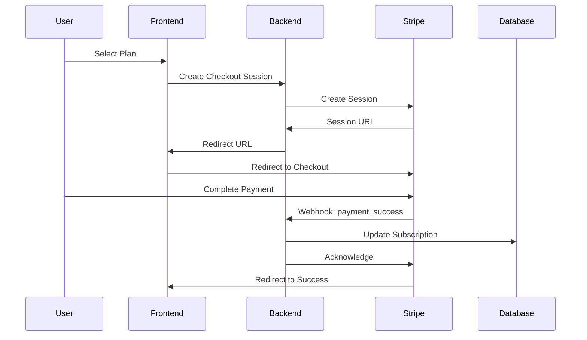

## Flujo de Workflow de Servicios

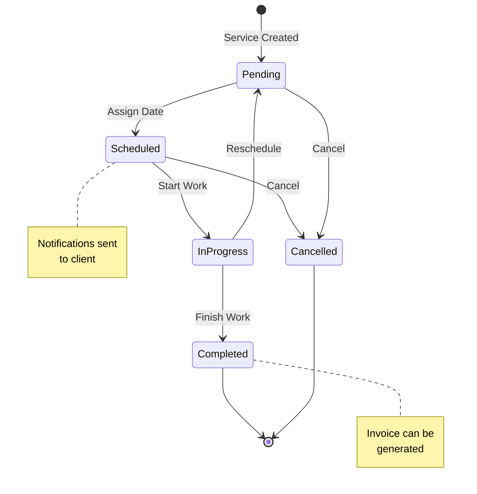

## Estructura de Módulos

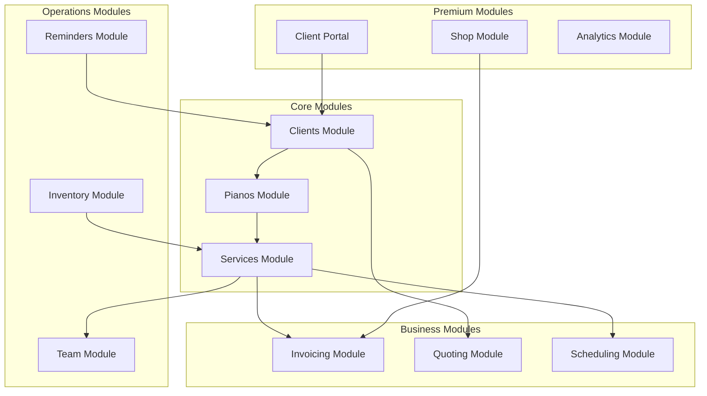

## Seguridad

### Capas de Seguridad

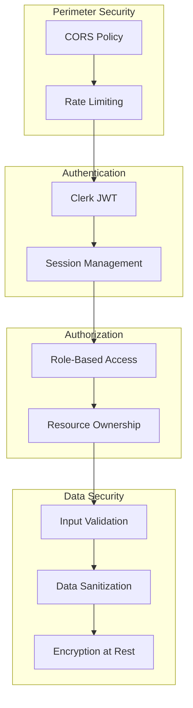

## Despliegue

### Arquitectura de Despliegue

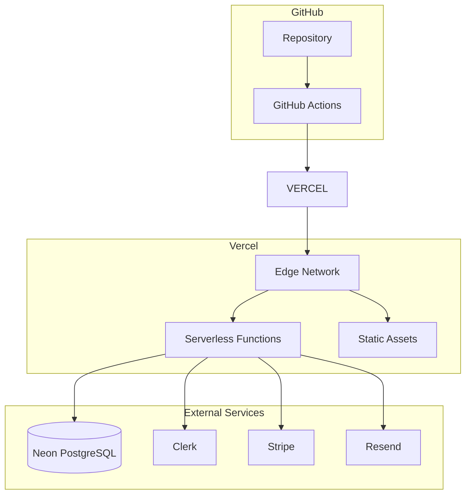

## Escalabilidad

### Consideraciones de Escalabilidad

| Componente | Estrategia |
|------------|------------|
| Frontend | CDN de Vercel, Edge caching |
| API | Serverless auto-scaling |
| Base de Datos | Neon auto-scaling, connection pooling |
| Autenticación | Clerk managed service |
| Pagos | Stripe managed service |

### Patrones Implementados

1. **Serverless Functions**: Escalado automático sin gestión de servidores
2. **Edge Caching**: Assets estáticos en CDN global
3. **Connection Pooling**: Gestión eficiente de conexiones a BD
4. **Lazy Loading**: Carga diferida de componentes
5. **Memoization**: Cache de resultados de cálculos costosos

## Monitorización

### Métricas Clave

- Tiempo de respuesta de API
- Tasa de errores
- Uso de base de datos
- Conversiones de pago
- Usuarios activos

### Herramientas

- Vercel Analytics
- Sentry (error tracking)
- Stripe Dashboard
- Clerk Dashboard
